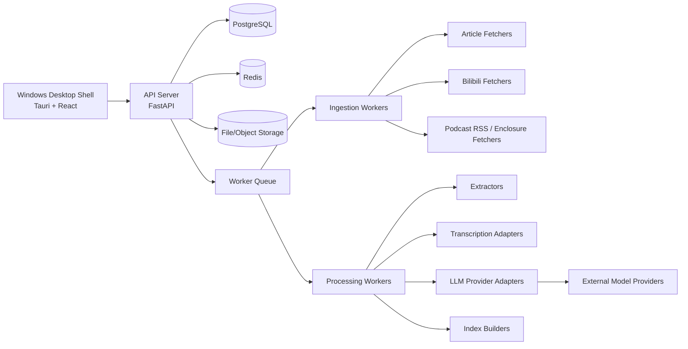
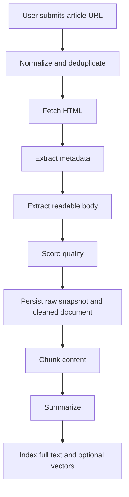
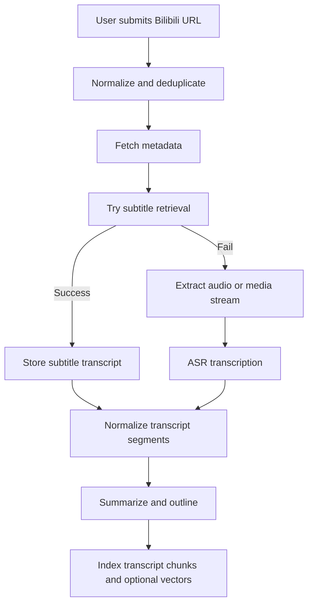
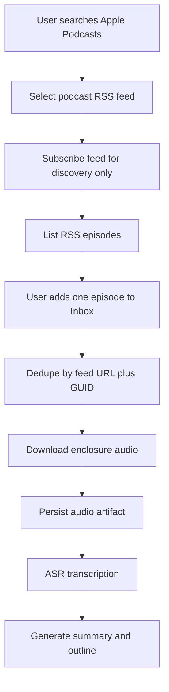
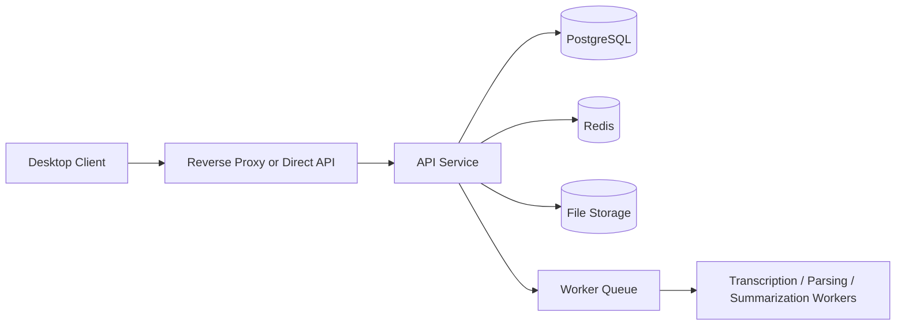

# OneRadar Architecture V1

## 1. Architecture Goals

OneRadar V1 is a reader-first personal knowledge library with manual link input plus a scoped podcast subscription surface.

The architecture must support these constraints:

- Manual item creation only.
- Supported inputs: article links, Bilibili video links, and explicitly imported podcast episodes from user-subscribed podcast RSS feeds.
- Server-first execution with a Windows desktop client.
- Docker-based deployment for the server.
- Subtitle-first, then ASR transcription for video items.
- Optional multimodal visual enhancement for video items after subtitle/ASR text exists.
- First-class provider registry for chat, embedding, transcription, and visual-understanding model use.
- Web-first UI rendered inside a desktop shell.

The architecture should optimize for:

- Low coupling between ingestion, parsing, AI, search, and presentation.
- Clear fallback paths when a source or provider fails.
- Future portability to mobile or PWA without rewriting the entire backend.
- Practical reuse of mature open-source components rather than building every parser from scratch.

## 2. System Overview

OneRadar is split into four logical layers:

- Desktop client.
- API server.
- Worker pipeline.
- Storage and external providers.

The desktop client never performs heavy ingestion or transcription work locally in V1.

The server owns:

- URL normalization and deduplication.
- Fetching, extraction, and transcription orchestration.
- Provider registry and secret management.
- Search indexing.
- Persistent content storage.

The desktop client owns:

- Server connection setup and single-user workspace bootstrap.
- Import UI.
- Library browsing.
- Reading and annotation UI.
- Provider settings UI.
- Import workbench UI for manual link submission and source-specific auth such as Bilibili cookies.
- Podcast UI for Apple search, RSS subscription management, and explicit episode import.
- Bilibili QR-code login helper for explicit app-based authorization, modeled after bilidown-style login UX.
- Desktop-only local helper for explicit Chromium cookie import when the user chooses to read Bilibili browser cookies into OneRadar.

## 3. Core Design Principles

### 3.1 Manual input only

V1 does not crawl the web proactively.

Every content item starts from a user action. Article and Bilibili items start from a user-supplied URL. Podcast episode items start when the user explicitly adds a discovered episode to Inbox / later reading.

- Article pipeline.
- Bilibili pipeline.
- Podcast episode pipeline.

Podcast subscriptions are discovery state, not content items. Subscribing to a podcast RSS feed never downloads audio and never triggers model work by itself.

### 3.2 Source-specific pipelines behind a shared item model

The UI should operate on a unified `content_item` abstraction.

The backend may ingest different source types, but the output must be normalized into:

- Metadata.
- Readable body or transcript.
- AI summaries.
- Searchable chunks.
- User annotations and reading state.

### 3.2 Integration settings

Provider configuration and site-specific integration secrets should not share the same storage record.

For V1, keep a separate integration-settings layer for source-specific auth such as Bilibili cookies:

- `integration_key = bilibili`
- server-only cookie storage
- QR-code login stores cookies only after user confirmation in the Bilibili mobile app
- masked previews in API responses
- no raw cookie echo in desktop UI
- worker-side lookup just before Bilibili fetch steps

This keeps provider credentials and source credentials isolated while preserving a consistent server-owned secret model.

### 3.3 Provider abstraction first

Model access must be managed through a provider registry.

The product must not hard-code one vendor into:

- Summarization.
- Embeddings.
- Transcription.

### 3.4 Subtitle-first video processing

For Bilibili items, the preferred order is:

1. Existing subtitles.
2. Automatic subtitles where available.
3. Audio extraction.
4. ASR transcription.

If multimodal visual enhancement is enabled, the worker keeps the subtitle/ASR result as the canonical readable transcript, then sends a sampled short video clip to a video-capable multimodal model. If direct video analysis is unavailable or fails, the worker falls back to sampled video frames. The model output adds supplemental context about slides, diagrams, screen content, demonstrations, actions, and scene changes. Visual enhancement is non-blocking: failure should be recorded as a pipeline step and should not prevent transcript-based import completion.

Implementation note:

- Evaluate `BBDown` and `Bilibili All In One` first for Bilibili-specific metadata, subtitle retrieval, and authenticated fallback handling.
- Use `bilidown` as a product reference for QR-code login state and Cookie acquisition UX, not as the media pipeline dependency.
- Keep a direct Bilibili `x/player/playurl` DASH-audio fallback for public videos that can be accessed without cookies.
- Keep `yt-dlp` as the generic media fallback rather than the first Bilibili-specific integration choice.
- Treat `Bilibili All In One` as a technical template until its runtime domains and credential handling are explicitly approved.

Transcript timestamps must be preserved for jump-back behavior.

### 3.5 Web-first UI, desktop-shell delivery

The client is a desktop shell around a web UI.

This keeps the UI reusable for future PWA or mobile-oriented work while still delivering a Windows desktop product in V1.

## 4. Service Responsibilities

### 4.1 Desktop Client

Responsibilities:

- Server connection and workspace bootstrap.
- Manual item import.
- Library list and detail pages.
- Podcast search, subscription, and explicit episode import.
- Reading view for articles and transcripts.
- Highlight and note interaction.
- Collection and tag management.
- Provider settings and connection testing.

Non-responsibilities:

- Direct media download.
- Direct transcription.
- Heavy parsing or indexing.

### 4.2 API Server

Responsibilities:

- Single-user workspace bootstrap and internal ownership context.
- CRUD APIs for content, annotations, collections, reading state, and providers.
- Import orchestration and task creation.
- Query APIs for search and item detail.
- Secure storage and retrieval of provider configuration.
- Serving assets and computed outputs.

### 4.3 Worker Layer

Responsibilities:

- Fetch URLs.
- Parse HTML.
- Extract readable article content.
- Retrieve Bilibili metadata and subtitles.
- Extract audio when needed.
- Run transcription.
- Chunk content.
- Generate summaries and outlines.
- Build search and vector indexes.

Worker jobs should be idempotent when possible and retryable when not.

### 4.4 Storage Layer

Responsibilities:

- Persist canonical item records.
- Persist raw inputs and extracted outputs.
- Persist annotations, reading state, and collections.
- Persist task state and provider configuration.
- Persist full-text and vector indexes.

## 5. Ingestion Pipelines

## 5.1 Article Pipeline

Implementation notes:

- Use a fetch layer with SSRF protections and domain allow/deny handling.
- Run more than one extraction strategy when the first output is low quality.
- Preserve both the raw HTML snapshot and the cleaned readable text.
- If summarization fails, the item should still be readable and searchable.

Suggested component order:

1. URL normalization and content-item creation.
2. Metadata fetch.
3. Main-content extraction.
4. Extraction quality check.
5. Fallback extraction if needed.
6. Chunking and indexing.
7. Optional summary generation.

### 5.2 Bilibili Pipeline

Implementation notes:

- Subtitle retrieval is the preferred path.
- ASR is a fallback path, not the default if subtitles exist.
- Transcripts must store segment boundaries and timestamps.
- Jump-back actions in the UI depend on accurate segment metadata.

Suggested component order:

1. URL normalization and content-item creation.
2. Bilibili metadata retrieval.
3. Subtitle retrieval.
4. Audio extraction if subtitles are unavailable.
5. Transcription.
6. Transcript normalization and chunking.
7. Summary and outline generation.
8. Indexing.

Implementation candidates for steps 2 to 4:

- `BBDown`: Bilibili-first downloader and subtitle helper.
- `Bilibili All In One`: compact auth-aware reference for subtitle-first and media fallback flows.
- Direct Bilibili `x/player/playurl`: lightweight anonymous DASH-audio fallback for public videos where the legacy playback API is available.
- `yt-dlp`: generic fallback when platform-specific helpers are insufficient.

Implementation baseline:

- Worker tasks resolve the enabled provider with a configured transcription model before running ASR.
- When subtitle retrieval returns no transcript, the worker first tries a shell-free BBDown subprocess wrapper, then a direct Bilibili `x/player/playurl` DASH-audio extractor, then a shell-free `yt-dlp` subprocess wrapper, and passes the produced audio file into the transcription adapter.
- The first adapter is OpenAI-compatible audio transcription using the provider base URL, decrypted server-side key, and configured transcription model.
- Optional visual enhancement uses the enabled chat/vision-capable provider model after transcript generation, tries direct sampled-video-clip analysis first, falls back to sampled frames when needed, and persists the model output as a `visual_context` summary.
- Bilibili cookies are passed to media tools through temporary files/configs, not through persisted task results, and those temporary files are removed after use.
- Task results and persisted metadata expose provider/model names and transcript status, but not raw provider API keys or source-site cookies.

### 5.3 Podcast Pipeline

Implementation notes:

- Apple iTunes Search API is the MVP discovery provider because it can return podcast RSS `feedUrl` values without a user API key.
- RSS subscriptions should be stored server-side and treated as source configuration.
- RSS polling/preview reads episode metadata and enclosure URLs but does not download media.
- Only the explicit episode-import endpoint creates `content_items.content_type = podcast_episode`.
- Podcast audio is persisted for future reprocessing and should be deleted when the corresponding content item is deleted.
- Podcast reader UX should prioritize the audio player and AI summaries; transcript text is supporting material, not the main reading surface.

## 6. Provider Architecture

Provider support is a first-class subsystem.

### 6.1 Provider Registry

The provider registry stores one or more configured providers for a user.

Each provider entry should describe:

- Provider name.
- Provider type.
- Base URL or endpoint.
- Secret reference or encrypted key.
- Supported model families.
- Default models by capability.
- Enabled or disabled state.
- Connection test metadata.

Provider types in V1 should at least support:

- OpenAI-compatible.
- Doubao preset.
- Custom provider.

### 6.2 Capability-Based Model Selection

The app should select models by capability, not by one global default model.

Capabilities:

- Chat / summarization.
- Embedding.
- Transcription.
- Video visual understanding, resolved to a visual-capable chat model in V1.

Implementation baseline:

- `ProviderCapability.summarization` resolves to the configured chat/summarization model.
- `ProviderCapability.embedding` resolves to the configured embedding model.
- `ProviderCapability.transcription` resolves to the configured transcription model.
- `ProviderCapability.video_visual_understanding` resolves to the configured chat model for V1, because the provider registry does not yet expose a dedicated visual model field.
- Runtime provider config may include a decrypted key for server-side adapters, but public API responses expose only whether a key is configured.

This lets the user mix providers, for example:

- One provider for summaries.
- Another for embeddings.
- Another for transcription.

### 6.3 Adapter Interface

Each provider capability should be isolated behind an adapter.

Recommended adapter groups:

- `chat/summarization adapter`
- `embedding adapter`
- `transcription adapter`
- `video visual-understanding adapter`

Adapter behavior should be consistent:

- Validate configuration before use.
- Surface typed errors for provider failure.
- Support connection testing.
- Emit minimal provider-specific assumptions into the rest of the system.

### 6.4 Provider Resolution Flow

1. Request references a capability.
2. Registry resolves the enabled provider for that capability.
3. Server builds the request payload from the adapter contract.
4. Adapter sends the call.
5. Result is normalized into internal response shapes.
6. Errors are recorded against the task, not directly exposed as raw vendor output.

## 7. Storage Boundaries

### 7.1 PostgreSQL

PostgreSQL is the system of record for:

- Users.
- Content items.
- Parsed documents.
- Transcripts.
- Summaries.
- Highlights.
- Notes.
- Tags.
- Collections.
- Reading state.
- Processing tasks.
- Provider registry metadata.

### 7.2 File or Object Storage

Use file/object storage for:

- Raw HTML snapshots.
- Extracted article text artifacts when helpful.
- Audio or media intermediates.
- Transcript exports.
- Covers and screenshots.

Storage should be content-addressed or path-constrained enough to avoid collisions and accidental leakage.

### 7.3 Redis

Redis is for:

- Queueing.
- Short-lived locks.
- Cacheable task state.
- Rate limiting or dedup hints.

Redis is not the canonical source of truth for content records.

### 7.4 Search Index

Initial search should use PostgreSQL full-text capabilities.

If vector search is added later, it should remain an optional secondary index, not a replacement for the canonical document store.

## 8. Security Boundaries

### 8.1 Ingress Security

All URL ingestion must assume hostile input.

Required protections:

- SSRF-aware fetching.
- Scheme validation.
- Host/IP restrictions where applicable.
- Redirect handling with policy checks.
- Size and timeout limits.

### 8.2 Secret Handling

Provider keys and similar secrets must be protected server-side.

Rules:

- No raw keys in client storage.
- No raw keys in logs.
- No raw keys in task payloads unless encrypted and explicitly intended.

### 8.3 Media Processing Isolation

Media downloading and transcription should run in an isolated worker context.

This reduces the blast radius of:

- Untrusted media inputs.
- Library crashes.
- Long-running extraction jobs.

### 8.4 Asset Access

Assets derived from imported content should not expose raw storage paths directly to the client.

If deployment-level access control is needed, keep it outside the V1 account UX, such as a reverse proxy or local network boundary.

### 8.5 Error Hygiene

Errors shown to users should be useful but not leak internal endpoints, keys, or stack traces.

Task logs may retain diagnostic detail, but sensitive values must be redacted.

## 9. Deployment Topology

V1 deployment should assume:

- One server container set.
- One Windows desktop client.
- Docker Compose on the server side.
- Local persistent storage mounted into the server runtime.

### 9.1 Server Topology

Recommended server containers:

- `api`
- `worker`
- `postgres`
- `redis`

Optional later containers:

- object storage backend.
- reverse proxy.

### 9.2 Request Flow

### 9.3 Local Persistence

The server deployment must persist:

- Database files or database volume.
- Raw assets and snapshots.
- Transcripts and exports.
- Configuration files.

If the deployment is reset, the product should not lose user-owned content unless the user explicitly deletes storage.

## 10. Phased Implementation Notes

### Phase 0: Architecture and contract setup

Deliverables:

- PRD alignment.
- Architecture doc.
- Database doc.
- API doc.
- Repo skeleton and module boundaries.

### Phase 1: Manual article import

Deliverables:

- URL import.
- Article extraction.
- Content list and detail page.
- Basic search.
- Reading state.

### Phase 2: Bilibili transcription path

Deliverables:

- Bilibili metadata retrieval.
- Subtitle retrieval.
- Audio extraction fallback.
- ASR transcription.
- Timestamp-aware transcript view.

### Phase 3: Provider registry

Deliverables:

- Provider CRUD.
- Presets.
- Connection test.
- Capability-specific selection.

### Phase 4: Annotation and organization

Deliverables:

- Highlights.
- Notes.
- Tags.
- Collections.
- Better reader ergonomics.

### Phase 5: Hardening and portability

Deliverables:

- Retry and failure recovery.
- Better SSRF and secret handling.
- Search tuning.
- Mobile/PWA readiness without backend rewrite.

## 11. Architectural Non-Goals

Do not introduce these into V1 architecture:

- Automatic content harvesting.
- RSS pipeline complexity.
- Cross-user collaboration features.
- Hard dependency on one model vendor.
- Heavy in-client media processing.
- Premature microservice decomposition.

## 12. Summary

OneRadar V1 should be built as a server-owned content library with a web-first desktop shell on top.

The server owns ingestion, extraction, provider selection, storage, and search.

The desktop client owns reading, annotation, organization, and configuration.

The most important architectural guardrails are:

- Manual input only.
- Subtitle-first Bilibili processing.
- Capability-based model providers.
- Strong separation between raw inputs, normalized documents, and user annotations.
- Docker-first server deployment.
