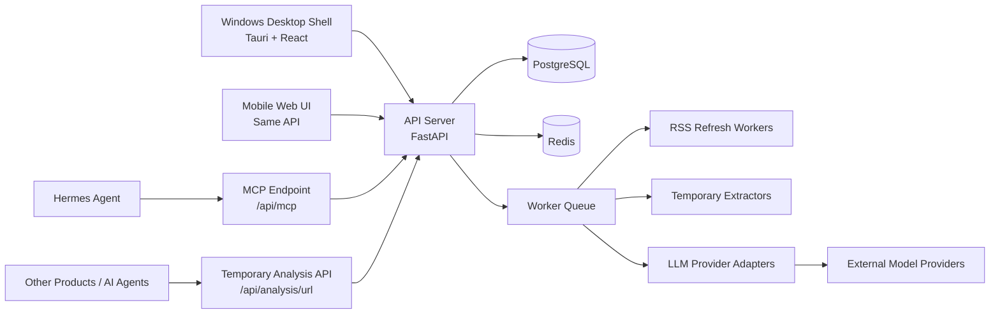
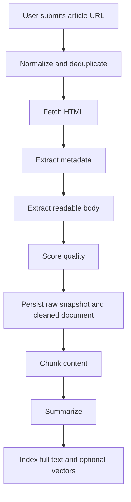
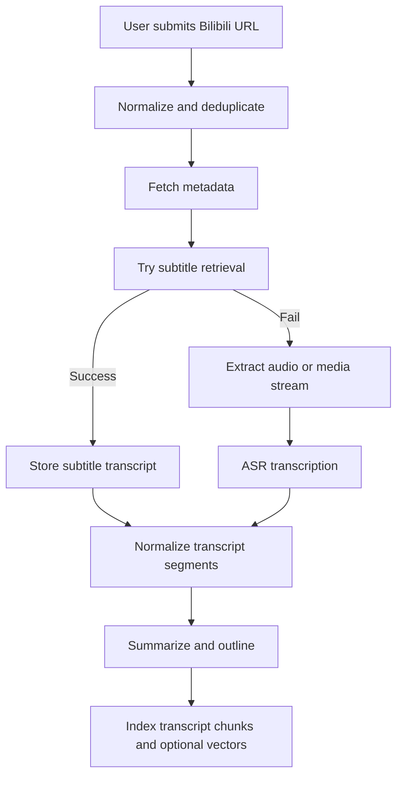
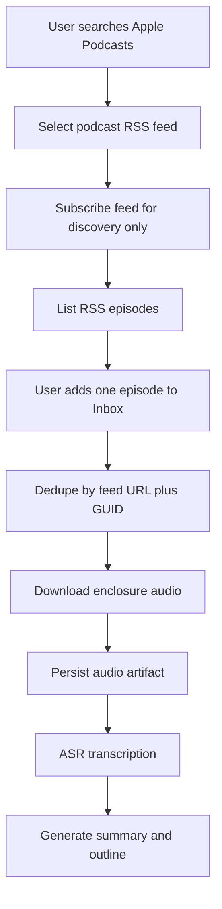
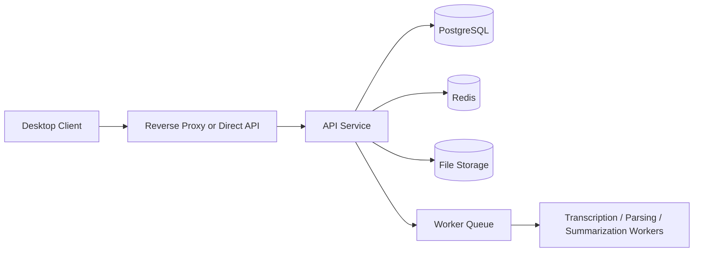

# OneRadar Architecture V1

## 1. Architecture Goals

OneRadar V1 is an information radar and temporary content-analysis service. It owns RSS source management, daily news generation, temporary URL analysis, MCP/API access, and provider configuration. It no longer owns the primary reading library, note-taking, saved collections, or personal knowledge-base workflow.

The architecture must support these constraints:

- User-managed RSS sources with continuous server-side refresh.
- Daily news generated from cached RSS entries.
- Temporary URL analysis for webpages, WeChat articles, Bilibili metadata, and future social/video platform adapters.
- No primary saved-reader, notes, highlights, folders, collections, or read/unread product flow.
- Server-first execution with a Windows desktop client.
- Docker-based deployment for the server.
- First-class provider registry for chat, embedding, transcription, and visual-understanding model use.
- Web-first UI rendered inside the desktop shell, with mobile web sharing the same information architecture.

The architecture should optimize for:

- Low coupling between ingestion, parsing, AI, search, and presentation.
- Clear fallback paths when a source or provider fails.
- Future portability to mobile, PWA, or Android without rewriting the entire backend.
- Practical reuse of mature open-source components rather than building every parser from scratch.

## 2. System Overview

OneRadar is split into four logical layers plus agent/API integration surfaces:

- Desktop client.
- API server.
- RSS refresh and analysis workers.
- Storage and external providers.
- MCP endpoint for trusted local agents such as Hermes.

The desktop client never performs heavy ingestion or transcription work locally in V1.

The MCP endpoint is hosted inside the API server rather than as a separate Docker service. It reuses the API process, database connection, feed cache, and refresh state. Its primary responsibility is news handoff for Hermes and other callers: list news sources, report source/window status, return RSS entries for a requested time window, and optionally trigger a current-user RSS refresh before returning data. It must not generate the Hermes morning briefing text; Hermes owns classification and final delivery so missing-news responsibility stays traceable.

The server owns:

- RSS source state, refresh, cached entries, and daily-news candidates.
- Temporary URL fetching, extraction, and summarization.
- Provider registry and secret management.
- Integration tokens for MCP and direct API calls.

The desktop client owns:

- Server connection setup and single-user workspace bootstrap.
- Daily news browsing.
- RSS source management and filtering.
- Temporary link analysis workbench.
- API/MCP token console.
- Provider settings UI.

## 3. Core Design Principles

### 3.1 RSS-first source ownership

OneRadar continuously refreshes only the RSS sources the user explicitly adds.

RSS is a bounded discovery surface, not a broad crawler. Cached entries accumulate until the source is deleted, newly refreshed non-Chinese entries are translated and stored on the feed entry row, and daily news is generated from this cached Chinese-first state.

### 3.2 Temporary analysis only for pasted links

Pasted links are analyzed on demand and returned to the caller. The analysis path must not create saved reading items, reading progress, folders, notes, highlights, or collections.

Current temporary adapters:

- Web/WeChat article extraction.
- Bilibili metadata and visible description.
- Planned YouTube, Douyin, Xiaohongshu, and richer Bilibili transcript adapters.

### 3.3 Integration settings

Provider configuration and site-specific integration secrets should not share the same storage record.

For V1, keep a separate integration-settings layer for source-specific auth such as Bilibili cookies:

- `integration_key = bilibili`
- server-only cookie storage
- QR-code login stores cookies only after user confirmation in the Bilibili mobile app
- masked previews in API responses
- no raw cookie echo in desktop UI
- worker-side lookup just before Bilibili fetch steps

This keeps provider credentials and source credentials isolated while preserving a consistent server-owned secret model.

### 3.4 Provider abstraction first

Model access must be managed through a provider registry.

The product must not hard-code one vendor into:

- Summarization.
- Embeddings.
- Transcription.

### 3.5 Future video/social adapter processing

For future full video analysis adapters, the preferred order is:

1. Existing subtitles.
2. Automatic subtitles where available.
3. Audio extraction.
4. ASR transcription.

If the current LLM provider declares video, image, or audio input support, the worker uses those input capability flags to decide whether to send a sampled video clip, sampled frames, or extracted audio to the model. Subtitle text is fetched whenever available and is included in the multimodal prompt so the model can align visual/audio interpretation with the timeline. If the multimodal path is unavailable or fails, the worker falls back to ASR. The model output adds supplemental context about slides, diagrams, screen content, demonstrations, actions, scene changes, audio cues, and missed spoken context. Multimodal enhancement is non-blocking: failure should be recorded as a pipeline step and should not prevent subtitle/ASR-based import completion.

Implementation note:

- Evaluate `BBDown` and `Bilibili All In One` first for Bilibili-specific metadata, subtitle retrieval, and authenticated fallback handling.
- Use `bilidown` as a product reference for QR-code login state and Cookie acquisition UX, not as the media pipeline dependency.
- Keep a direct Bilibili `x/player/playurl` DASH-audio fallback for public videos that can be accessed without cookies.
- Keep `yt-dlp` as the generic media fallback rather than the first Bilibili-specific integration choice.
- Treat `Bilibili All In One` as a technical template until its runtime domains and credential handling are explicitly approved.

Transcript timestamps should be returned in structured results when available, but OneRadar does not need an internal reader to consume them.

### 3.6 Web-first UI

The primary client is a desktop shell around a web UI. Mobile web follows the same product shape: daily news, RSS sources, link analysis, API/settings.

This keeps the product coherent across web and desktop while the Docker-served web app remains the production runtime.

## 4. Service Responsibilities

### 4.1 Desktop Client

Responsibilities:

- Server connection and workspace bootstrap.
- Daily news browsing.
- RSS source management and source/date filtering.
- Temporary link analysis.
- API/MCP endpoint and token visibility.
- Provider settings and connection testing.

Non-responsibilities:

- Direct media download.
- Direct transcription.
- Heavy parsing or indexing.

### 4.2 API Server

Responsibilities:

- Single-user workspace bootstrap and internal ownership context.
- RSS source, cache, refresh, and daily-news APIs.
- Temporary URL analysis API.
- MCP news-source JSON-RPC endpoint.
- Integration token APIs.
- Secure storage and retrieval of provider configuration.

### 4.3 Worker Layer

Responsibilities:

- Refresh RSS sources and persist feed entries.
- Fetch and extract temporary URL analysis inputs.
- Retrieve Bilibili metadata for temporary analysis.
- Generate daily-news and link-analysis summaries through the configured provider.
- Support future platform-specific transcript or original-text adapters.

Worker jobs should be idempotent when possible and retryable when not.

### 4.4 Storage Layer

Responsibilities:

- Persist canonical item records.
- Persist raw inputs and extracted outputs.
- Persist annotations, reading state, and collections.
- Persist task state and provider configuration.
- Persist full-text and vector indexes.

## 5. Ingestion Pipelines

## 5.1 Article Pipeline

Implementation notes:

- Use a fetch layer with SSRF protections and domain allow/deny handling.
- Run more than one extraction strategy when the first output is low quality.
- Preserve both the raw HTML snapshot and the cleaned readable text.
- If summarization fails, the item should still be readable and searchable.

Suggested component order:

1. URL normalization and content-item creation.
2. Metadata fetch.
3. Main-content extraction.
4. Extraction quality check.
5. Fallback extraction if needed.
6. Chunking and indexing.
7. Optional summary generation.

### 5.2 Bilibili Pipeline

Implementation notes:

- Subtitle retrieval is the preferred path.
- Subtitles are fetched whenever available to preserve timeline jumps and provide prompt context.
- ASR is the fallback when subtitles are missing, when the text-only path needs a fuller transcript, or when multimodal analysis fails.
- Transcripts must store segment boundaries and timestamps.
- Jump-back actions in the UI depend on accurate segment metadata.

Suggested component order:

1. URL normalization and content-item creation.
2. Bilibili metadata retrieval.
3. Subtitle retrieval.
4. Audio extraction if subtitles are unavailable.
5. Transcription.
6. Transcript normalization and chunking.
7. Summary and outline generation.
8. Indexing.

Implementation candidates for steps 2 to 4:

- `BBDown`: Bilibili-first downloader and subtitle helper.
- `Bilibili All In One`: compact auth-aware reference for subtitle-first and media fallback flows.
- Direct Bilibili `x/player/playurl`: lightweight anonymous DASH-audio fallback for public videos where the legacy playback API is available.
- `yt-dlp`: generic fallback when platform-specific helpers are insufficient.

Implementation baseline:

- Worker tasks resolve the enabled provider with a configured transcription model before running ASR.
- When subtitle retrieval returns no transcript, the worker first tries a shell-free BBDown subprocess wrapper, then a direct Bilibili `x/player/playurl` DASH-audio extractor, then a shell-free `yt-dlp` subprocess wrapper, and passes the produced audio file into the transcription adapter.
- The first adapter is OpenAI-compatible audio transcription using the provider base URL, decrypted server-side key, and configured transcription model.
- Multimodal enhancement uses the enabled LLM provider only when its input capability flags include video, image, or audio. Video input is tried as sampled clip analysis, image input as sampled frame fallback, and audio input as direct audio-plus-subtitle analysis. The output is persisted as a `visual_context` summary.
- Bilibili cookies are passed to media tools through temporary files/configs, not through persisted task results, and those temporary files are removed after use.
- Task results and persisted metadata expose provider/model names and transcript status, but not raw provider API keys or source-site cookies.

### 5.3 Podcast Pipeline

Implementation notes:

- Apple iTunes Search API is the MVP discovery provider because it can return podcast RSS `feedUrl` values without a user API key.
- RSS subscriptions should be stored server-side and treated as source configuration.
- RSS polling/preview reads episode metadata and enclosure URLs but does not download media.
- Only the explicit episode-import endpoint creates `content_items.content_type = podcast_episode`.
- Podcast audio is persisted for future reprocessing and should be deleted when the corresponding content item is deleted.
- Podcast reader UX should prioritize the audio player and AI summaries; transcript text is supporting material, not the main reading surface.

## 6. Provider Architecture

Provider support is a first-class subsystem.

### 6.1 Provider Registry

The provider registry stores one or more configured providers for a user.

Each provider entry should describe:

- Provider name.
- Provider type.
- Base URL or endpoint.
- Secret reference or encrypted key.
- Supported model families.
- Input capabilities for each model: text, image, audio, and video.
- Default models by capability.
- Enabled or disabled state.
- Connection test metadata.

Provider types in V1 should at least support:

- OpenAI-compatible.
- Doubao preset.
- DeepSeek preset.
- Custom provider.

### 6.2 Capability-Based Model Selection

The app should select models by capability, not by one global default model.

Capabilities:

- Chat / summarization.
- Embedding.
- Transcription.
- Video visual understanding, resolved to a visual-capable chat model in V1.

Implementation baseline:

- `ProviderCapability.summarization` resolves to the configured chat/summarization model.
- `ProviderCapability.embedding` resolves to the configured embedding model.
- `ProviderCapability.transcription` resolves to the configured transcription model.
- `ProviderCapability.video_visual_understanding` resolves to the configured chat model for V1, and runtime routing checks that provider's input capability flags before sending video, image, or audio payloads.
- Runtime provider config may include a decrypted key for server-side adapters, but public API responses expose only whether a key is configured.
- Provider records are user-created and must be complete before saving. At runtime there is only one enabled/current provider per capability, so LLM and ASR selection are independent instead of sharing a global enabled flag.
- Provider records may store model input capability flags, but V1 does not ask users to maintain vendor-specific maximum file sizes, maximum media durations, or long-audio/video support because those limits are often undocumented or model-release dependent.

This lets the user mix providers, for example:

- One provider for summaries.
- Another for embeddings.
- Another for transcription.

### 6.3 Adapter Interface

Each provider capability should be isolated behind an adapter.

Recommended adapter groups:

- `chat/summarization adapter`
- `embedding adapter`
- `transcription adapter`
- `video visual-understanding adapter`

Adapter behavior should be consistent:

- Validate configuration before use.
- Surface typed errors for provider failure.
- Support connection testing.
- Emit minimal provider-specific assumptions into the rest of the system.

### 6.4 Provider Resolution Flow

1. Request references a capability.
2. Registry resolves the enabled provider for that capability.
3. Server builds the request payload from the adapter contract.
4. Adapter sends the call.
5. Result is normalized into internal response shapes.
6. Errors are recorded against the task, not directly exposed as raw vendor output.

## 7. Storage Boundaries

### 7.1 PostgreSQL

PostgreSQL is the system of record for:

- Users.
- RSS sources and cached entries.
- Daily news reports.
- Integration tokens.
- Provider registry metadata.

### 7.2 File or Object Storage

Use file/object storage for:

- Raw HTML snapshots.
- Extracted article text artifacts when helpful.
- Audio or media intermediates.
- Transcript exports.
- Covers and screenshots.

Storage should be content-addressed or path-constrained enough to avoid collisions and accidental leakage.

### 7.3 Redis

Redis is for:

- Queueing.
- Short-lived locks.
- Cacheable task state.
- Rate limiting or dedup hints.

Redis is not the canonical source of truth for content records.

### 7.4 Search Index

Initial search should use PostgreSQL full-text capabilities.

If vector search is added later, it should remain an optional secondary index, not a replacement for the canonical document store.

## 8. Security Boundaries

### 8.1 Ingress Security

All URL ingestion must assume hostile input.

Required protections:

- SSRF-aware fetching.
- Scheme validation.
- Host/IP restrictions where applicable.
- Redirect handling with policy checks.
- Size and timeout limits.

### 8.2 Secret Handling

Provider keys and similar secrets must be protected server-side.

Rules:

- No raw keys in client storage.
- No raw keys in logs.
- No raw keys in task payloads unless encrypted and explicitly intended.

### 8.3 Media Processing Isolation

Media downloading and transcription should run in an isolated worker context.

This reduces the blast radius of:

- Untrusted media inputs.
- Library crashes.
- Long-running extraction jobs.

### 8.4 Asset Access

Assets derived from imported content should not expose raw storage paths directly to the client.

If deployment-level access control is needed, keep it outside the V1 account UX, such as a reverse proxy or local network boundary.

### 8.5 Error Hygiene

Errors shown to users should be useful but not leak internal endpoints, keys, or stack traces.

Task logs may retain diagnostic detail, but sensitive values must be redacted.

## 9. Deployment Topology

V1 deployment should assume:

- One server container set.
- One Windows desktop client.
- Docker Compose on the server side.
- Local persistent storage mounted into the server runtime.
- Local Windows development and testing, GitHub as the private source-control and release coordination point, and the production server as the durable web/server runtime.

### 9.1 Server Topology

Recommended server containers:

- `api`
- `worker`
- `postgres`
- `redis`

Optional later containers:

- object storage backend.
- reverse proxy.

### 9.2 Request Flow

### 9.3 Local Persistence

The server deployment must persist:

- Database files or database volume.
- Raw assets and snapshots.
- Transcripts and exports.
- Configuration files.

If the deployment is reset, the product should not lose user-owned content unless the user explicitly deletes storage.

Production deployment assumptions and persistent data rules are tracked in `docs/deployment_v1.md`.

## 10. Phased Implementation Notes

### Phase 0: Architecture and contract setup

Deliverables:

- PRD alignment.
- Architecture doc.
- Database doc.
- API doc.
- Repo skeleton and module boundaries.

### Phase 1: RSS and daily news

Deliverables:

- RSS source management.
- Server-side refresh and cached entries.
- Daily-news generation and saved reports.
- Direct source opening.

### Phase 2: Temporary link analysis

Deliverables:

- Web/WeChat readable-text extraction.
- Bilibili metadata analysis.
- Model-backed summary with extractive fallback.
- JSON result for downstream callers.

### Phase 3: Provider registry

Deliverables:

- Provider CRUD.
- Presets.
- Connection test.
- Capability-specific selection.

### Phase 4: API/MCP integration

Deliverables:

- MCP news-source tools.
- Integration tokens.
- Direct analysis API.
- API console in the desktop UI.

### Phase 5: Hardening and portability

Deliverables:

- Retry and failure recovery.
- Better SSRF and secret handling.
- Search tuning.
- Mobile/PWA readiness without backend rewrite.

## 11. Architectural Non-Goals

Do not introduce these into V1 architecture:

- Automatic content harvesting.
- Broad non-RSS crawling.
- Cross-user collaboration features.
- Hard dependency on one model vendor.
- Heavy in-client media processing.
- Premature microservice decomposition.
- Built-in personal knowledge base, note-taking, highlights, folders, collections, or read/unread workflows as primary product surfaces.

## 12. Summary

OneRadar V1 should be built as a server-owned information radar and temporary analysis service with a web-first desktop shell on top.

The server owns RSS refresh, daily news, temporary extraction, provider selection, and integration tokens.

The desktop client owns source operations, daily-news browsing, link analysis, API visibility, and configuration.

The most important architectural guardrails are:

- RSS source ownership without broad crawling.
- Temporary link analysis without persistence into a reader.
- Capability-based model providers.
- Strong separation between OneRadar's transient analysis output and external long-term knowledge storage.
- Docker-first server deployment.
