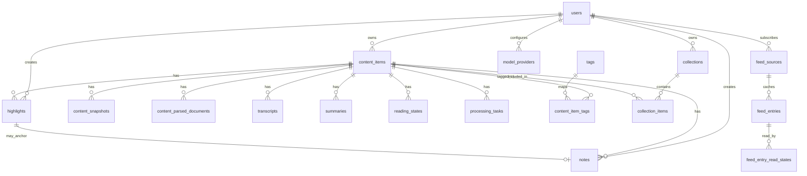

# OneRadar Database V1

## 1. Goals

This document defines the V1 PostgreSQL-first data model for OneRadar.

Design goals:

- Support a reader-first library for manually submitted links.
- Keep article items and Bilibili video items in one unified content model.
- Preserve raw source material, cleaned readable content, and derived AI results.
- Treat annotations, collections, and reading state as core product data.
- Make transcription and summarization outputs traceable to their source.
- Stay easy to migrate and easy to index.

PostgreSQL is the system of record. Search indexes and other derived structures are secondary.

---

## 2. Design Principles

### 2.1 One Main Item Table

Use `content_items` as the root object for everything the user saves.

An item may originate from:

- an article URL
- a Bilibili video URL
- an explicitly imported podcast episode from a subscribed podcast RSS feed

The item type decides which processing pipeline runs, but the user-facing record remains unified.

### 2.2 Store Raw, Cleaned, and Derived Forms Separately

Keep these layers distinct:

- raw source material
- extracted readable content
- transcript text and timestamps
- summaries and outlines
- user annotations

This avoids data loss and makes reprocessing possible.

### 2.3 Favor Small, Typed Tables

Use normalized tables for core entities.

Use `jsonb` only when structure is intentionally flexible:

- transcript segments
- structured parser output
- model/provider configuration metadata
- task payloads and results

### 2.4 Keep Search Computed

Do not make search the only representation of content.

Use PostgreSQL full-text search indexes and optionally embeddings later.

### 2.5 Make Reprocessing Safe

Processing outputs should be versionable or replaceable without losing source data.

The database must support:

- retrying failed tasks
- re-running parsing
- re-running summary generation
- switching provider settings later

---

## 3. Core Entity Map



---

## 4. Table Catalog

### 4.1 `users`

V1 is single-user first, but keep a `users` table so the schema can expand without a rewrite.

Recommended columns:

- `id uuid pk`
- `username text not null unique`
- `password_hash text not null`
- `display_name text`
- `created_at timestamptz not null default now()`
- `updated_at timestamptz not null default now()`

Indexes:

- unique index on `username`

---

### 4.2 `content_items`

Root record for all saved items.

Recommended columns:

- `id uuid pk`
- `user_id uuid not null fk users(id)`
- `content_type text not null`
- `source_platform text not null`
- `source_url text not null`
- `normalized_url text not null`
- `external_id text`
- `title text not null`
- `subtitle text`
- `author_name text`
- `author_id text`
- `cover_url text`
- `duration_seconds integer`
- `language text`
- `published_at timestamptz`
- `imported_at timestamptz not null default now()`
- `status text not null`
- `visibility text not null default 'private'`
- `raw_meta jsonb not null default '{}'::jsonb`
- `fetch_hash text`
- `created_at timestamptz not null default now()`
- `updated_at timestamptz not null default now()`

Recommended `content_type` values:

- `article`
- `bilibili_video`
- `podcast_episode`

Recommended `source_platform` values:

- `web`
- `bilibili`
- `podcast`

Recommended `status` values:

- `pending`
- `processing`
- `completed`
- `failed`
- `archived`

Indexes:

- unique index on `(user_id, normalized_url)`
- index on `(user_id, status, imported_at desc)`
- index on `(user_id, content_type, imported_at desc)`
- index on `(user_id, source_platform, imported_at desc)`

Rationale:

- `normalized_url` is the primary dedupe key for manually submitted links.
- `status` is useful for inbox and retry UX.
- `raw_meta` holds source-specific metadata without forcing schema churn.
- Current implementation stores soft-delete state in `raw_meta.deleted_at` and treats it as a 7-day 最近删除 marker. Normal item lists, folder counts, and detail reads exclude unexpired deleted items; the trash endpoint exposes them for restore or permanent purge. This avoids schema churn during the V1 spike, but a future migration may promote `deleted_at` to a typed column if deletion workflows become more central.

Podcast note:

- Podcast subscriptions can initially be stored as service configuration under `integration_settings.integration_key = 'podcasts'`.
- Imported podcast episodes are normal `content_items` with `content_type = 'podcast_episode'`.
- Their `normalized_url` should be a stable synthetic episode identity derived from feed URL plus GUID, falling back to enclosure URL.
- Their `raw_meta.podcast` stores feed URL, podcast title, episode link, enclosure URL, enclosure type/length, image URL, and persisted audio path.

---

### 4.3 RSS discovery cache tables

RSS discovery is persisted in PostgreSQL so Docker Compose deployments and desktop restarts keep loaded feeds without relying on browser-local storage.

Tables:

- `feed_sources`: one row per subscribed RSS URL, scoped by `user_id`. Stores source URL, site title/link/description, last loaded time, and last refresh status/error.
- `feed_entries`: cached RSS entries for a source. Stores stable entry id, article link, title, summary, author, published time, tags, and raw item metadata. Entries remain until the source is removed.
- `feed_entry_read_states`: per-user read markers for cached entries.

Indexes:

- unique index on `feed_sources(user_id, source_url)`
- unique index on `feed_entries(feed_source_id, entry_id)`
- index on `feed_entries(user_id, published_at desc)`
- unique index on `feed_entry_read_states(user_id, feed_entry_id)`

Rules:

- Loading or refreshing a feed upserts entries and records refresh success or failure.
- Opening an RSS article preview marks the cached feed entry as read.
- Removing a source deletes its cached entries and read markers through cascade.
- Saving an RSS article to 稍后阅读 creates a normal `content_items` record and persists the cleaned article body there; the feed cache remains only the discovery surface.

---

### 4.4 `content_snapshots`

Stores raw source material and fetch results.

Recommended columns:

- `id uuid pk`
- `content_item_id uuid not null fk content_items(id)`
- `snapshot_type text not null`
- `storage_path text`
- `html_text text`
- `http_status integer`
- `content_hash text`
- `fetched_at timestamptz not null default now()`
- `source_headers jsonb not null default '{}'::jsonb`
- `extra jsonb not null default '{}'::jsonb`
- `created_at timestamptz not null default now()`

Recommended `snapshot_type` values:

- `article_html`
- `bilibili_metadata`
- `bilibili_subtitle`
- `bilibili_media_manifest`
- `bilibili_audio`
- `podcast_audio`

Podcast audio rule:

- Podcast RSS subscriptions do not create audio snapshots.
- A `podcast_audio` snapshot is created only after the user explicitly adds an episode to Inbox / later reading.
- The snapshot `storage_path` points at the persisted audio artifact used for future reprocessing.
- Deleting the `content_items` row for a podcast episode should delete the persisted audio artifact as part of item cleanup.

Indexes:

- index on `(content_item_id, fetched_at desc)`
- index on `(content_item_id, snapshot_type, fetched_at desc)`
- unique partial index on `(content_item_id, content_hash)` when `content_hash` is present

Rationale:

- Keep original material for auditing and reprocessing.
- Avoid losing source HTML after extraction succeeds.

---

### 4.5 `content_parsed_documents`

Stores cleaned, readable article content or normalized text output.

Recommended columns:

- `id uuid pk`
- `content_item_id uuid not null fk content_items(id)`
- `parser_name text not null`
- `parser_version text not null`
- `title text`
- `excerpt text`
- `byline text`
- `language text`
- `plain_text text not null`
- `structured_blocks jsonb not null default '[]'::jsonb`
- `quality_score numeric(4,2)`
- `source_snapshot_id uuid fk content_snapshots(id)`
- `created_at timestamptz not null default now()`
- `updated_at timestamptz not null default now()`

Recommended `structured_blocks` shape:

```json
[
  {
    "type": "paragraph",
    "text": "..."
  }
]
```

Indexes:

- unique index on `(content_item_id, parser_name, parser_version)`
- GIN index on `structured_blocks` if querying blocks directly
- full-text search index on `plain_text`

Rationale:

- Multiple parser attempts may exist for the same item.
- Keep the final reader-visible version separate from raw HTML.

---

### 4.6 `transcripts`

Stores subtitle or ASR output for Bilibili items.

Recommended columns:

- `id uuid pk`
- `content_item_id uuid not null fk content_items(id)`
- `transcript_type text not null`
- `provider_name text`
- `model_name text`
- `language text`
- `full_text text not null`
- `segments jsonb not null`
- `confidence_score numeric(4,2)`
- `source_snapshot_id uuid fk content_snapshots(id)`
- `created_at timestamptz not null default now()`
- `updated_at timestamptz not null default now()`

Recommended `transcript_type` values:

- `subtitle`
- `asr`
- `refined_asr`

Recommended `segments` shape:

```json
[
  {
    "start_ms": 0,
    "end_ms": 5320,
    "speaker": null,
    "text": "..."
  }
]
```

Indexes:

- index on `(content_item_id, transcript_type, created_at desc)`
- GIN index on `segments` only if segment-level filtering is needed
- full-text search index on `full_text`

Rationale:

- Store timestamps explicitly because jump-back is a core user behavior.
- Keep subtitles and ASR outputs distinct so quality and provenance remain visible.

---

### 4.7 `summaries`

Stores one or more AI-generated summaries per item.

Recommended columns:

- `id uuid pk`
- `content_item_id uuid not null fk content_items(id)`
- `summary_type text not null`
- `provider_name text`
- `model_name text`
- `version integer not null default 1`
- `content text not null`
- `source_parsed_document_id uuid fk content_parsed_documents(id)`
- `source_transcript_id uuid fk transcripts(id)`
- `evidence jsonb not null default '[]'::jsonb`
- `created_at timestamptz not null default now()`

Recommended `summary_type` values:

- `one_line`
- `short`
- `outline`
- `key_points`

Indexes:

- index on `(content_item_id, summary_type, version desc)`
- unique index on `(content_item_id, summary_type, version)`

Rationale:

- Summaries should be replaceable and versioned.
- Link them to source material so regressions can be traced.

---

### 4.8 `highlights`

Stores user highlights on readable text.

Recommended columns:

- `id uuid pk`
- `content_item_id uuid not null fk content_items(id)`
- `user_id uuid not null fk users(id)`
- `anchor_type text not null`
- `quote_text text not null`
- `start_anchor text`
- `end_anchor text`
- `start_offset integer`
- `end_offset integer`
- `segment_index integer`
- `color text`
- `note_id uuid`
- `created_at timestamptz not null default now()`
- `updated_at timestamptz not null default now()`

Recommended `anchor_type` values:

- `article_text`
- `transcript_segment`

Indexes:

- index on `(user_id, content_item_id, created_at desc)`
- index on `(content_item_id, created_at desc)`
- index on `(note_id)` for joined retrieval

Rationale:

- Supports both article selection and transcript selection.
- Offsets are useful for articles; segment indexes are useful for transcripts.

---

### 4.9 `notes`

Stores user notes, either standalone or attached to a highlight.

Recommended columns:

- `id uuid pk`
- `content_item_id uuid not null fk content_items(id)`
- `user_id uuid not null fk users(id)`
- `highlight_id uuid fk highlights(id)`
- `content text not null`
- `created_at timestamptz not null default now()`
- `updated_at timestamptz not null default now()`

Indexes:

- index on `(user_id, content_item_id, created_at desc)`
- index on `(highlight_id)` where not null

Rationale:

- A note can exist on its own or as an annotation for a specific highlight.

---

### 4.10 `tags`

Global tag dictionary.

Recommended columns:

- `id uuid pk`
- `user_id uuid not null fk users(id)`
- `name text not null`
- `normalized_name text not null`
- `created_at timestamptz not null default now()`

Indexes:

- unique index on `(user_id, normalized_name)`
- index on `(user_id, name)`

Rationale:

- Normalization prevents duplicates that differ only in case or spacing.

---

### 4.11 `content_item_tags`

Join table between items and tags.

Recommended columns:

- `content_item_id uuid not null fk content_items(id)`
- `tag_id uuid not null fk tags(id)`
- `score numeric(4,2)`
- `created_at timestamptz not null default now()`

Primary key:

- `(content_item_id, tag_id)`

Indexes:

- index on `(tag_id, content_item_id)`

Rationale:

- Join table is enough for V1.
- `score` leaves room for auto-suggested tags later.

---

### 4.12 `collections`

User-defined groups for organization.

Recommended columns:

- `id uuid pk`
- `user_id uuid not null fk users(id)`
- `name text not null`
- `description text`
- `is_favorite boolean not null default false`
- `created_at timestamptz not null default now()`
- `updated_at timestamptz not null default now()`

Indexes:

- unique index on `(user_id, name)`
- index on `(user_id, is_favorite, created_at desc)`

Rationale:

- Collections are a stable organization primitive for the reader app.

---

### 4.13 `collection_items`

Join table for collection membership.

Recommended columns:

- `collection_id uuid not null fk collections(id)`
- `content_item_id uuid not null fk content_items(id)`
- `created_at timestamptz not null default now()`

Primary key:

- `(collection_id, content_item_id)`

Indexes:

- index on `(content_item_id, collection_id)`

Rationale:

- Keep membership simple and easy to query from both directions.

---

### 4.14 `reading_states`

Per-item reading progress and UI state.

Recommended columns:

- `id uuid pk`
- `content_item_id uuid not null fk content_items(id)`
- `user_id uuid not null fk users(id)`
- `progress_percent numeric(5,2) not null default 0`
- `last_position_type text`
- `last_position_value text`
- `is_read boolean not null default false`
- `is_archived boolean not null default false`
- `is_favorited boolean not null default false`
- `last_read_at timestamptz`
- `updated_at timestamptz not null default now()`

Recommended `last_position_type` values:

- `article_offset`
- `transcript_segment`

Indexes:

- unique index on `(user_id, content_item_id)`
- index on `(user_id, is_read, last_read_at desc)`
- index on `(user_id, is_archived, last_read_at desc)`
- index on `(user_id, is_favorited, last_read_at desc)`

Rationale:

- Reading state is core navigation data, not a convenience field.

---

### 4.15 `processing_tasks`

Tracks asynchronous work and failures.

Recommended columns:

- `id uuid pk`
- `content_item_id uuid not null fk content_items(id)`
- `task_type text not null`
- `status text not null`
- `priority integer not null default 0`
- `attempt_count integer not null default 0`
- `max_attempts integer not null default 3`
- `locked_by text`
- `payload jsonb not null default '{}'::jsonb`
- `result jsonb not null default '{}'::jsonb`
- `error_message text`
- `started_at timestamptz`
- `finished_at timestamptz`
- `next_retry_at timestamptz`
- `created_at timestamptz not null default now()`
- `updated_at timestamptz not null default now()`

Recommended `task_type` values:

- `fetch_meta`
- `fetch_html`
- `extract_article`
- `fetch_subtitles`
- `extract_audio`
- `transcribe_audio`
- `generate_summary`
- `build_index`
- `reprocess_item`
- `sync_provider_test`

Recommended `status` values:

- `pending`
- `running`
- `retrying`
- `success`
- `failed`
- `canceled`

Indexes:

- index on `(status, priority desc, created_at asc)`
- index on `(content_item_id, task_type, created_at desc)`
- index on `(next_retry_at)` where status in `('retrying', 'pending')`

Rationale:

- Task history helps with retries, diagnostics, and UX feedback.
- `payload` and `result` keep task-specific details without schema explosion.

---

### 4.16 `model_providers`

Stores provider configuration for model access.

Recommended columns:

- `id uuid pk`
- `user_id uuid not null fk users(id)`
- `provider_name text not null`
- `provider_type text not null`
- `display_name text not null`
- `base_url text`
- `api_key_encrypted text`
- `chat_model text`
- `embedding_model text`
- `transcription_model text`
- `is_enabled boolean not null default true`
- `is_builtin boolean not null default false`
- `config jsonb not null default '{}'::jsonb`
- `last_test_status text`
- `last_tested_at timestamptz`
- `created_at timestamptz not null default now()`
- `updated_at timestamptz not null default now()`

Recommended `provider_type` values:

- `openai_compatible`
- `doubao`
- `custom`

Indexes:

- unique index on `(user_id, provider_name)`
- index on `(user_id, is_enabled, created_at desc)`

Rationale:

- Provider support is a first-class product feature.
- Keep credentials protected and provider-specific settings flexible.

---


### 4.17 `integration_settings`

Stores server-side source integration secrets and toggles that are not model providers.

Recommended columns:

- `id uuid pk`
- `user_id uuid not null fk users(id)`
- `integration_key text not null`
- `display_name text not null`
- `is_enabled boolean not null default false`
- `config jsonb not null default '{}'::jsonb`
- `created_at timestamptz not null default now()`
- `updated_at timestamptz not null default now()`

Recommended `integration_key` values in V1:

- `bilibili`

Indexes:

- unique index on `(user_id, integration_key)`

Rationale:

- Bilibili cookie state is operationally different from provider credentials.
- The worker can read source-specific auth just-in-time without leaking raw values back to the client.

---

## 5. Relationship Rules

### 5.1 Ownership

- A `content_item` belongs to one `user`.
- A `tag`, `collection`, `model_provider`, and `integration_setting` also belong to one `user`.

### 5.2 Item-Centric Derivatives

The following records all attach to one `content_item`:

- snapshots
- parsed documents
- transcripts
- summaries
- highlights
- notes
- reading state
- processing tasks
- item-tag mappings
- collection membership mappings

### 5.3 Annotation Anchoring

Annotations must be attachable to:

- article text
- transcript text

Use explicit anchor metadata so UI rendering does not depend on guesswork.

### 5.4 Provider Linkage

Provider choice is not stored inside the content item as a hard dependency.

Instead:

- tasks store which provider produced a result
- summaries and transcripts store provider/model provenance
- provider configs remain independently editable

---

## 6. Indexing Strategy

### 6.1 Primary Query Paths

Optimize for these user-facing queries:

- recent imports
- unread items
- failed items
- search by title or content
- filter by tag or collection
- open item and load its current reading state
- open item and load its latest summary or transcript

### 6.2 B-Tree Indexes

Use B-tree indexes for:

- foreign keys
- ownership filters
- status filters
- ordering by created/imported/read time

### 6.3 Full-Text Search

Create tsvector-based search indexes for:

- parsed article text
- transcript full text
- summary content
- item title if desired

Recommended approach:

- maintain generated or materialized `tsvector` columns in the database or build them in the application layer before insert/update
- keep search columns per table instead of one giant cross-table blob

Suggested fallback order:

1. title match
2. body/full-text match
3. transcript match
4. summary match

### 6.4 JSONB Indexes

Use GIN indexes on JSONB only when querying into the JSON structure is required.

Likely candidates:

- transcript segments
- parser block structure
- task payload/result
- provider config

### 6.5 Optional Vector Indexing

V1 does not need vector search to be first-class.

If embeddings are added later, use a separate embeddings table and index it independently.

Do not replace the relational store with a vector-first design.

---

## 7. State and Enum Definitions

### 7.1 `content_items.status`

Recommended:

- `pending`
- `processing`
- `completed`
- `failed`
- `archived`

### 7.2 `processing_tasks.status`

Recommended:

- `pending`
- `running`
- `retrying`
- `success`
- `failed`
- `canceled`

### 7.3 `content_items.content_type`

Recommended:

- `article`
- `bilibili_video`

### 7.4 `content_items.source_platform`

Recommended:

- `web`
- `bilibili`

### 7.5 `transcripts.transcript_type`

Recommended:

- `subtitle`
- `asr`
- `refined_asr`

### 7.6 `summaries.summary_type`

Recommended:

- `one_line`
- `short`
- `outline`
- `key_points`

### 7.7 `model_providers.provider_type`

Recommended:

- `openai_compatible`
- `doubao`
- `custom`

### 7.8 `reading_states.last_position_type`

Recommended:

- `article_offset`
- `transcript_segment`

### 7.9 `highlights.anchor_type`

Recommended:

- `article_text`
- `transcript_segment`

---

## 8. Migration and Versioning Guidance

### 8.1 Migration Strategy

Use normal relational migrations.

Keep schema changes incremental:

- add nullable column
- backfill
- switch reads
- enforce constraint later

### 8.2 Reprocessing Strategy

If parser or model behavior changes:

- create a new parsed document or summary version
- preserve provenance fields
- update the latest visible pointer in the app layer if needed

### 8.3 Deletion Strategy

Use soft deletion where user experience benefits from recovery:

- archived items
- hidden tasks
- deprecated provider configs

Use hard deletion only when the user explicitly requests full removal and the implementation policy supports it.

---

## 9. Practical SQL Notes

- Prefer `uuid` primary keys for distributed-friendly inserts.
- Use `timestamptz` everywhere for time fields.
- Use `text` for flexible names and URLs.
- Use `jsonb` for provider configs, task payloads, structured blocks, and transcript segments.
- Avoid over-normalizing source metadata that changes by platform.

Recommended extensions to consider later:

- `pg_trgm` for fuzzy title search
- `uuid-ossp` or application-generated UUIDs
- optional vector extension if embeddings become first-class

---

## 10. Table Priority Order

Implement in this order:

1. `users`
2. `content_items`
3. `content_snapshots`
4. `content_parsed_documents`
5. `transcripts`
6. `summaries`
7. `reading_states`
8. `tags`
9. `content_item_tags`
10. `collections`
11. `collection_items`
12. `highlights`
13. `notes`
14. `processing_tasks`
15. `model_providers`
16. `integration_settings`

Reason:

- This order matches the V1 closed loop from ingest to read to annotate to manage providers.

---

## 11. Open Questions

These are intentionally left unresolved until implementation starts:

- Whether `content_items.visibility` is needed in V1 beyond `private`.
- Whether summaries need separate `evidence` rows instead of JSONB.
- Whether a dedicated embeddings table is needed in V1 or only later.
- Whether soft-delete columns should be standardized across all tables.

Do not block the V1 design on these questions.
